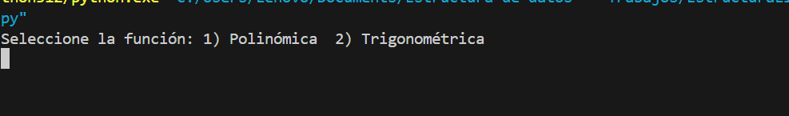
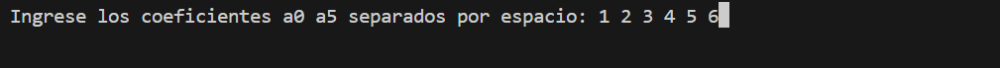

<h1>Proyecto 2 Metodos numericos</h1>

<h1>Instrucciones</h1>

1️⃣ `Selecciona la ecuación:` El usuario debe elegir entre dos opciones de ecuaciones disponibles, cada una con su respectiva forma matemática.

2️⃣ `Define los coeficientes:` Una vez seleccionada la ecuación, el usuario proporciona los valores de los coeficientes necesarios.

3️⃣ `Elige el método de solución:` El usuario escoge el método numérico que desea utilizar entre las siguientes opciones: bisección, Newton, secante o regla falsa.

4️⃣ `Proporciona los insumos:` El programa solicita al usuario datos esenciales, como el intervalo o valores iniciales, según el método de solución elegido.

5️⃣ `Establece el criterio de paro`: El usuario define el criterio de terminación, ya sea el número de iteraciones o el error deseado.

6️⃣ `Obtén los resultados:` El programa calcula y muestra la raíz de la ecuación, el número de iteraciones realizadas y el error obtenido.

-----------
Resultados finales:

----------

